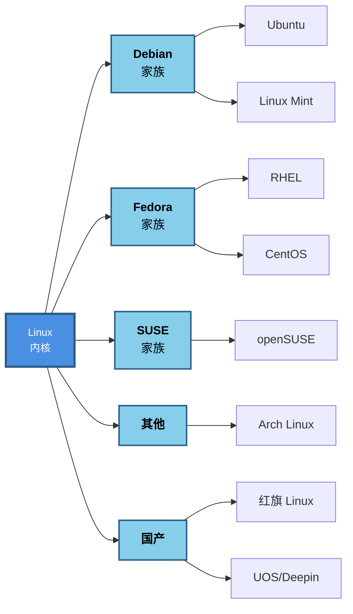

# 从入门到入土的Linux的第一课：Linux极速入门

## Linux 是什么
Linux 是一套免费使用和自由传播的类 Unix 操作系统，是一个基于 POSIX 和 UNIX 的多用户、多任务、支持多线程和多 CPU 的操作系统。

Linux 能运行主要的 UNIX 工具软件、应用程序和网络协议。它支持 32 位和 64 位硬件。Linux 继承了 Unix 以网络为核心的设计思想，是一个性能稳定的多用户网络操作系统。

## Linux 的发行版

**btw，I use Arch**
